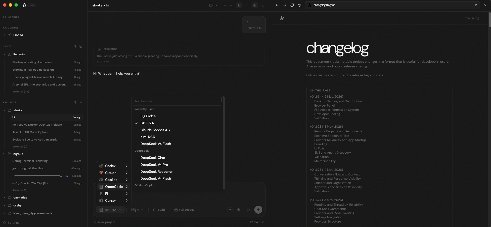
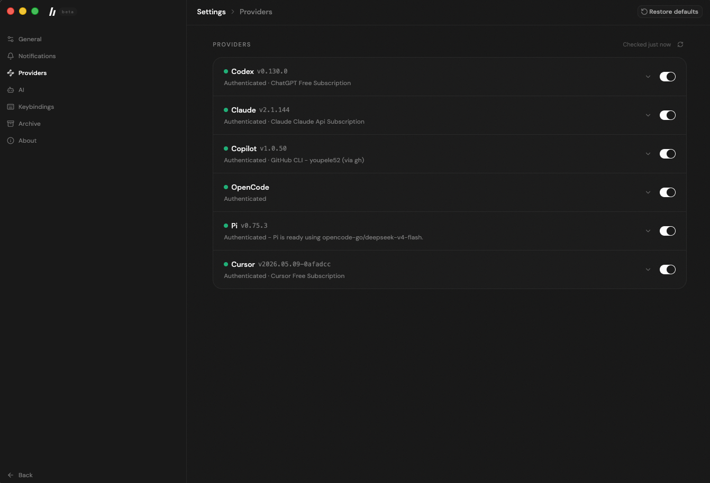

# bigbud

<p align="center">
  
</p>

An AI workspace for everyone. It keeps your research, writing, coding, files, and git workflows in one place so you can stay focused and get more done with less context switching.

> **About the name:** This project was formally known as **bigCode** ([https://github.com/youpele52/bigCode](https://github.com/youpele52/bigCode)). The rebranding to **bigbud** reflects our evolved vision: while we excel at coding tasks, we're expanding to help anyone accomplish their goals. Like a good friend, bigbud is here to be useful to everyone — programmers and non-programmers alike.
>
> _Note:_ The original bigCode repository was either hacked or DMCA'd — while the page returns a 404, its Actions and Settings pages are still accessible.

## Table of Contents

- [Features](#features)
- [Quick Install](#quick-install)
  - [Desktop App](#desktop-app)
  - [From Source](#from-source)
- [Provider Setup](#provider-setup)
- [Remote Projects](#remote-projects)
- [Speech to Text](#speech-to-text)
  - [Bring Your Own Key](#bring-your-own-key)
  - [How It Works](#how-it-works)
  - [Usage](#usage)
- [Desktop vs Web](#desktop-vs-web)
- [Documentation](#documentation)
- [Development](#development)
  - [Desktop Packaging](#desktop-packaging)
- [Status](#status)

## Features

- **Multi-provider support** — Switch between Codex, Claude, Copilot, OpenCode, Pi, Cursor, and more
- **Remote projects over SSH** — Work against remote folders without moving the full AI runtime onto the remote machine
- **Desktop & Web** — Native Electron desktop app or lightweight web UI
- **Embedded browser** — Open links in-app, keep browser history, and attach annotated page context to chats
- **Real-time streaming** — Live output with file changes, terminal commands, shell logs, and reasoning updates
- **Live speech-to-text** — Speak to your agent with real-time transcription powered by OpenAI
- **Built-in terminal and chat shell mode** — Use the integrated terminal or run quick composer commands like `!ls`
- **Replies, pinning, and thread organization** — Reply to any message, pin important chats, and keep context intact across reconnects
- **Approvals and full access mode** — Review approval requests with better thread context, or auto-approve commands and edits for autonomous runs
- **System control** — Tell agents to execute commands and perform tasks on your PC/Mac
- **Thread forking** — Branch a conversation from any point to explore alternatives

<p align="center">
  
</p>

## Quick Install

### Desktop App

Download the latest version for your platform at **[bigbud.app/download](https://bigbud.app/download/)**.

Alternatively, install via terminal:

**macOS / Linux:**

```bash
curl -fsSL https://raw.githubusercontent.com/youpele52/bigbud/main/apps/marketing/public/install.sh | sh
```

**Windows:**

```powershell
powershell -NoProfile -ExecutionPolicy Bypass -Command "irm https://raw.githubusercontent.com/youpele52/bigbud/main/apps/marketing/public/install.ps1 | iex"
```

### From Source

```bash
git clone https://github.com/youpele52/bigbud.git
cd bigbud
bun install
bun dev
```

Open [`http://localhost:5733`](http://localhost:5733) in your browser.

For desktop development:

```bash
bun dev:desktop
```

## Provider Setup

bigbud supports multiple AI coding agents. Configure at least one in **Settings → Providers**:

| Provider     | Setup                                                                               |
| ------------ | ----------------------------------------------------------------------------------- |
| **Claude**   | Install Claude Code: `npm i -g @anthropic-ai/claude-code`, then `claude auth login` |
| **Copilot**  | Authenticate via GitHub CLI: `gh auth login`                                        |
| **Codex**    | Install Codex CLI and run `codex login`                                             |
| **OpenCode** | See [OpenCode docs](https://opencode.ai)                                            |
| **Pi**       | Bundled — no additional setup needed                                                |
| **Cursor**   | Install [Cursor](https://cursor.sh)                                                 |

Provider status is checked in real-time and displayed in Settings. Each provider can be toggled on or off independently.

## Remote Projects

bigbud can connect to remote projects over SSH while keeping the app experience local.

- **Remote workspace support** — Open and work in remote projects across Codex, Claude, Copilot, OpenCode, and Pi where supported
- **Safer reconnects** — After restart, saved remote workspaces stay disconnected until SSH access is verified again
- **Flexible unlock flow** — Reconnect with SSH keys or temporary password-based SSH unlock without saving secrets

## Speech to Text

Voice dictation powered by OpenAI's Realtime Transcription API. Add an API key in **Settings → Speech to Text** to enable it.

### Bring Your Own Key

The feature uses your own OpenAI API key — you must have one configured to use voice input. This keeps costs separate and avoids bigbud needing access to your OpenAI account.

### How It Works

- **Audio capture:** Uses the Web Audio API with an `AudioWorkletNode` to capture microphone input as PCM16 at 24 kHz
- **Streaming:** Audio streams directly from your browser to OpenAI via WebSocket — it never touches the bigbud server
- **Turn detection:** Manual control — press and hold to record, release to send. Partial transcription appears in real-time as you speak
- **Model:** Uses OpenAI's realtime transcription session flow with `gpt-realtime-whisper`

### Usage

1. Go to **Settings → AI → Speech to Text**
2. Enter your OpenAI API key (starts with `sk-`)
3. Click **Save & Verify** to validate the key
4. In the composer, click the microphone button and speak.

> **macOS:** The first time you use voice input, macOS will prompt you to grant microphone access. If you previously denied it, go to **System Settings → Privacy & Security → Microphone** and re-enable it for the app.

<p align="center">
  
</p>

## Desktop vs Web

|                     | Desktop                       | Web                       |
| ------------------- | ----------------------------- | ------------------------- |
| **Installation**    | Native installer              | `bun dev` or self-hosted  |
| **Server**          | Bundled — runs locally        | Requires separate server  |
| **Native features** | OS notifications, system tray | Browser-based only        |
| **Best for**        | Everyday use                  | Development, self-hosting |

## Documentation

- [AGENTS.md](./AGENTS.md) — Development guide
- [docs/CHANGELOG.md](./docs/CHANGELOG.md) — Recent project changes and grouped release history
- [CONTRIBUTING.md](./CONTRIBUTING.md) — Contribution guidelines
- [docs/release.md](./docs/release.md) — Release workflow & signing
- [docs/observability.md](./docs/observability.md) — Observability setup

## Development

```bash
# Full dev stack (server + web)
bun dev

# Individual apps
bun dev:server
bun dev:web
bun dev:desktop

# Run checks
bun fmt
bun lint
bun typecheck
bun run test   # Use this, not "bun test"
```

### Desktop Packaging

```bash
bun dist:desktop:dmg:arm64   # macOS Apple Silicon
bun dist:desktop:dmg:x64     # macOS Intel
bun dist:desktop:linux       # Linux AppImage
bun dist:desktop:win         # Windows NSIS installer
```

## Status

This is currently in beta. Expect rough edges and some breaking changes.
Bugs are few and fixed quickly because bigbud is actively used and maintained. See the [changelog](https://bigbud.app/changelog/) for recent updates.

We're not accepting contributions yet. See [CONTRIBUTING.md](./CONTRIBUTING.md) for details.
